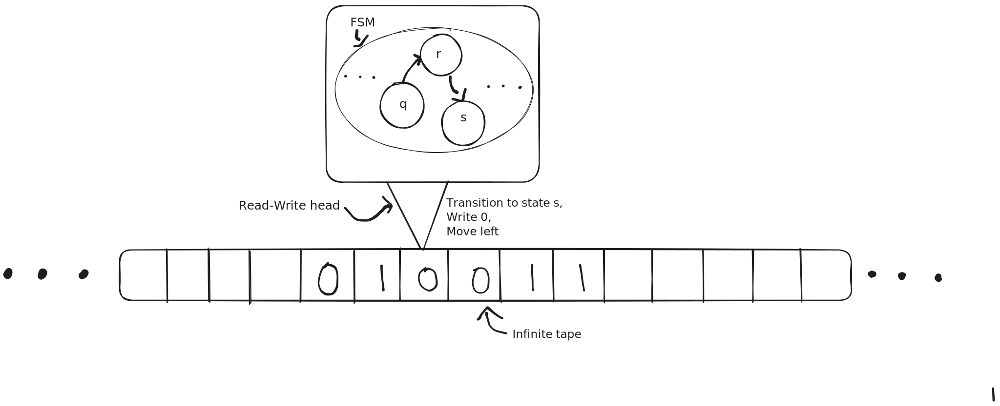
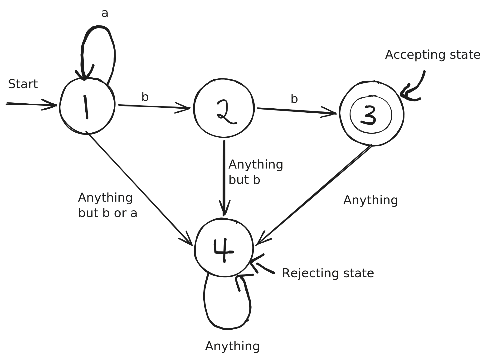
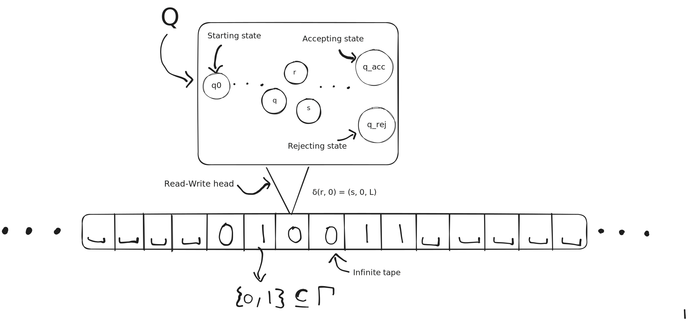

+++
title = 'An introduction to Turing machines and computation'
date = '2026-04-04'
draft = false
+++





## Introduction
This blog aims to provide a short (but slightly longer than intended), and potentially useful, introduction to Turing machines.
Turing machines are so fundamental to Computer Science and the study of computability (i.e. can this thing be computed? In finite time?) that an understanding of the key elements and results can only further one's appreciation for the field.

The study of Turing machines also leads to a proof of the halting problem, the fact that it is impossible to determine whether a program will halt or not given some input to that program.
This shattered a lot of the initial perceptions of computation garnered in the 1930s by proving that computation, while it may be powerful, is fundamentally limited.

### Should you read this?
This post finishes by proving the Turing-recognisability but lack of decidability of $\text{ACCEPTS}_\text{TM}$ (with a discussion on diagonalisation proofs following) after building up the necessary machinery and intuition.

If this seems like gibberish, then don't worry, I have tried to assume a low baseline of knowledge (which is built upon), and all non-trivial statements and definitions are accompanied by explanations and/or examples where possible.
Furthermore, any questions are welcome either by comment or by email (see the bottom of the page).

Alternatively, if you are already familiar with a formal approach to Turing machines and you are wondering if there is anything to gain from this post, I believe there might be in [this discussion about the connection between a proof of non-decidability and Cantor's theorem](#a-discussion-of-the-proof).
To parse it it may be helpful to read [this proof](#a-second,-more-exciting-result).

While I attempted to be rigorous at some points where I felt it may aid understanding or provide some needed structure, this is not intended to be a particularly formal work and should not be treated as such.

## The Turing machine
### The intuitive approach
While I imagine a majority of the people interested in this post will have an intuitive understanding of the Turing machine, I will just recount it here so we are all on the same page.
A Turing machine consists of a read-write head that can move left and right along an infinitely long tape.

It takes some input which it operates on, which is simply a sequence of characters. 
For example, it could be a binary string representing a program.
This input is put on the tape before the Turing machine starts its operation, while the rest of the tape is filled with blank characters.

The read-write head contains a Finite State Machine (FSM) that, given its current state in the FSM and what it is currently reading off the tape, decides
* the next state in the FSM
* what to write to the tape
* and whether to move left or right along the tape

Our intuition gives rise to this useful diagram


I hope this (intuition focused) explanation suffices for the rest of the blog.
* A FSM is a collection of states, typically denoted $Q$, and connections between those states.
* They act on some input, which consists of individual letters, e.g. for input $1000111$ the first letter would be $1$, the next $0$, etc.
* There exists a starting state, which is where the machine starts, an accepting state, where the machine reports success, and a rejecting state, where the machine reports failure.

For example, the below FSM recognises the input of any number of $a$'s, followed by 2 $b$'s.

The machine reads in $a$'s, until it reads either a $b$ or something else.
If it reads a $b$ then it goes to state 2, otherwise, it goes to state 4, our rejecting state. 
From the rejecting state (also sometimes known as a dead state), any input still leaves us in the rejecting state, as we have already classified the input as invalid.

From state 2, if we read a $b$, we go to our accepting state (typically denoted as the nested circle).
Otherwise, again, it's the rejecting state.
If we read anything after our two $b$'s, then the input is invalid, and hence we go to the rejecting state.

I use the term Finite State Machine to represent a more general Deterministic Finite Automata (DFA) that has a rejecting state instead of just dead states.
This is a term that is used in literature and it may be useful to research if you are interested in more.


### A mathematical approach
To define a Turing machine rigorously we define the *syntax* of a Turing machine. 
There are various ways to do this, but inspired by (but not completely following) Hopcroft & Ullman (1979) [^1], a Turing Machine is a 7-tuple
$$
M = (Q, \Sigma, \Gamma, q_0, q_\text{acc}, q_\text{rej}, \delta)
$$
where
* $Q$ is the finite set of states in the FSM
* $\Sigma$ is the set of input symbols (the ones originally on the tape), the input alphabet
* $\Gamma \supseteq \Sigma \cup \{\sqcup\}$ is the set of symbols that can be on the tape, the tape alphabet. It includes $\sqcup$, the blank symbol, which we use to represent the absence of data on the tape.
* $q_0 \in Q$ is the starting state in the FSM
* $q_\text{acc} \in Q$ is the only accepting state in the FSM
* $q_\text{rej} \in Q$ is the only rejecting state in the FSM
* $\delta : (Q \setminus \{ q_\text{acc}, q_\text{rej} \}) \times \Gamma \to Q \times \Gamma \times \{L, R\}$ is the transition function that takes us from one state and cell to another state and cell, rewriting the state we read in the process. We exclude $q_\text{acc}$ and $q_\text{rej}$ for input into the transition function as once the FSM for a Turing machine enters either of the states it immediately stops/halts.

We can now modify our diagram to fit our new definition

## Languages
In this area of computer science, models of computation (such as a Turing machine) are built to recognise languages.
However, to understand languages, we must first understand words!

### Words/Strings
A word, typically denoted $\omega$, is a finite, ordered collection (or tuple) of elements of $\Sigma$.
Recall that $\Sigma$ is the input alphabet of our Turing machine.
We typically denote the set of all ordered collections as $\Sigma^*$, leaning on a notation gained from regular expressions (which can actually represent the same things as FSMs, but that's a slightly different hole).
So we get that a word is any number of elements of $\Sigma$, or an element of $\Sigma^* = \bigcup_{n \ge 0} \Sigma^n$.

This use of regex notation illustrates something which we may have missed, words can be empty!
The empty word is denoted $\epsilon$ and just represents the absence of any elements of $\Sigma$.

For example, given $\Sigma = \{a, b, 0, 1\}$, valid words include
* $\epsilon$
* $a0bb1bbaaa$
* and $0000000$

From these examples you may have noted that the notation is really hands off, we just write elements next to each other. 
Instead of writing $(a, 0, b)$, we write $a0b$.
This works as elements of $\Sigma$ are typically only one character long.
If separators are needed, we write $a \circ 0 \circ b$ with $\circ$ representing concatenation.

### Languages from words
A language is a set of words that a machine potentially recognises/accepts.
We say a machine recognises a word, $\omega$, if after giving the machine $\omega$ as input, it ends up in the accepting state.
This process of *running* a machine on a word is called a *run*.
So we can say that a machine recognises a language if for every word, $\omega$, in our language, the run of the machine on $\omega$ is accepting.

Typically, we denote a language (just a set of words) as $L$, and the language recognised by a machine, $M$, as $\mathcal{L}(M)$.
That is, $M$ recognises $L$ if and only if
$$
\mathcal{L}(M) = L
$$

### Distinguishing Turing machines with respect to a language
This is where we first encounter the idea of *halting*.
We classify two types of Turing machine, with respect to a language $L$, a recogniser and a decider.

#### A recogniser
A Turing machine, $M$, is a recogniser for the language $L$ if the Turing machine recognises/accepts every word in the language and does not accept any word outside of the language.
We write this in notation as 
$$
M \text{ is a recogniser for } L
\iff
\forall w \in \Sigma^*
\begin{cases}
w \in L \implies M \text{ accepts } w\\
w \notin L \implies M \text{ does not accept } w
\end{cases}
$$
The distinction between "not accepting" and "rejecting" is that not accepting includes the possibility of a Turing machine looping forever, and this difference is the reason we need the next definition.
We get from this definition that $M$ is a recogniser for $\mathcal{L}(M)$.

#### A decider
While that definition was a bit mundane, the definition for a decider is (very) slightly less!
A Turing machine, $M$, is a decider for a language $L$ if 
* it is a recogniser for $L$
* and $\forall \ \omega \in \Sigma^*$, there is a halting run of $M$ on $\omega$.
That is
$$ 
\begin{gather}
&M \text{ is a decider for } L \\
& \iff
\forall w \in \Sigma^*,\ M \text{ halts on } w,\text{ and }
\begin{cases}
w \in L \implies M \text{ accepts } w\\
w \notin L \implies M \text{ rejects } w
\end{cases}
\end{gather}
$$

To understand this definition we must know what it means for a run to be halting.
Recall that a run of $M$ on $\omega$ is the process of passing $\omega$ as input to our machine and running it on that input.
A halting run is a restriction which requires that $M$ always finishes in finite time.
That is, within finite time, the machine always ends up in either $q_\text{acc}$ or $q_\text{rej}$.

This is the key distinction between a recogniser and a decider, a recogniser can go on for infinite time, never giving an answer, however a decider must finish and accept or reject a word in finite time.

### Distinguishing languages
Leaning the definitions laid out in [the previous section](#distinguishing-turing-machines-with-respect-to-a-language), we distinguish decidable languages and recognisable languages like so:
* A language is Turing-recognisable [^5] if there exists a recogniser Turing machine for it 
* A language is (Turing-)decidable [^6] if there exists a decider Turing machine for it

From these definitions we immediately get that the decidable languages are a subset of the Turing-recognisable languages (as decidability is a restriction of recognisability).

## A first result
All of this pre-requitising (my spell checker was **not** impressed with that) leads us to our first result!
We will show that the language 
$$
\begin{gather}
\text{ACCEPTS}_{\text{TM}} \\ = \{ \langle M, \omega\rangle : M \text{ is a Turing machine}, \omega \in \Sigma^*, M \text{ accepts } \omega \}
\end{gather}
$$
is Turing-recognisable [^2].

We immediately come to the issue that the definition of $\text{ACCEPTS}_{\text{TM}}$ does not make sense, what does $\langle M, \omega \rangle$ represent?

In this case (and in the future cases in this blog), $\langle M, \omega\rangle$ represents some unified representation or encoding of the Turing machine $M$ and the word $\omega$ that we can run Turing machines on and represent on a tape.
For example, it could be a binary representation of the machine in the form of the 7-tuple discussed in [the mathematical definition](#a-mathematical-approach) followed by some separation character, followed by a binary representation of the word.

So, $\text{ACCEPTS}_{\text{TM}}$ is the language of representations of Turing machines and words such that the Turing machine accepts that word.
For example, if we had a Turing machine, $M$, that recognised the word $a$, $\langle M, a \rangle$ would be in $\text{ACCEPTS}_{\text{TM}}$.

Now while this proof isn't necessarily required, it allows us to provide some idea of an upper bound for the problem and provides us some intuition for the next, harder proof.

### Proof of Turing-recognisability
To begin, we construct a Turing machine $U$[^3] which on input $\langle M, \omega \rangle$:
* Simulates $M$ on $\omega$ step by step [^4]
* If $M$ accepts, $U$ accepts
* If $M$ rejects, $U$ rejects 
* If $M$ loops forever, $U$ loops forever

We can see that $U$ is a recogniser for $\text{ACCEPTS}_\text{TM}$ as any input $\langle M, \omega \rangle$ such that $M$ accepts $\omega$, will be accepted, and any input such that $M$ rejects $\omega$ will not be accepted. Precisely the definition of $\text{ACCEPTS}_\text{TM}$.
We also explicitly allow for the infinite loop case, which makes $U$ a recogniser and not a decider.

## A second, more exciting result
Now we will answer a more exciting, and hard, question.
We have shown that $\text{ACCEPTS}_{\text{TM}}$ is at least Turing-recognisable, which we said was one of the pre-requisites for it to be decidable.
So now we just need to show that either there exists a machine that is a recogniser that will always halt, or that such a machine is impossible.
Unfortunately, such a machine is impossible.

### Proof of non-decidability
For the purposes of contradiction, let's assume that there exists a decider, $A$, such that $\mathcal{L}(A) = \text{ACCEPTS}_{\text{TM}}$.
Now let's construct another decider, $D$, that utilises $A$.
We say that $D$ will
* Take input $\langle M\rangle$, where $M$ is a Turing machine
* Simulate $A$ on $\langle M, \langle M \rangle \rangle$, which (as $A$ is a decider) we are guaranteed will halt
* If $A$ accepts, $D$ rejects, if $A$ rejects, then $D$ accepts
As we are guaranteed this chain of operations will always halt, we have that $D$ is a decider.

To represent this relationship in a contrived functional form, consider the below equation 
$$
D(\langle M \rangle) = \lnot A (\langle M, \langle M \rangle \rangle)
$$

Now, let's run $D$ on $\langle D \rangle$, this is a valid operation as $D$ is just some Turing machine that takes in an input of the form $\langle M \rangle$.
Take a moment to convince yourself that this is not recursive ($\langle D \rangle$ is just a *representation* of $D$).

We now consider the possible outcomes of this operation.
If $D$ accepts $\langle D \rangle$, then $A$ must have rejected $\langle D, \langle D \rangle \rangle$. However this is a contradiction, because as $D$ accepts $\langle D \rangle$, $\langle D, \langle D \rangle \rangle$ must be in $\text{ACCEPTS}_{\text{TM}}$ which means $A$ must accept it by the definition of $A.$

The other outcome of this operation is $D$ rejecting $\langle D \rangle$.
This means that $A$ will have accepted $\langle D, \langle D \rangle \rangle$ which leads to a similar contradiction.
We have that $\langle D, \langle D \rangle \rangle$ would not be in $\text{ACCEPTS}_{\text{TM}}$, but $A$ has accepted it, which via the definition of $A$ means it was in $\text{ACCEPTS}_{\text{TM}}$, a contradiction.

As both cases lead to a contradiction we can conclude that one of our assumptions must have been faulty and we arrive at the fact that $A$ could not have existed, hence there is no decider for $\text{ACCEPTS}_\text{TM}$.

### A discussion of the proof
This proof seems to rely on a cheeky trick, and hence isn't particularly useful to understand. 
Running $D$ on $\langle D \rangle$ definitely doesn't seem intuitive, and even defining $D$ the way we do seems a bit strange.
However, this proof is actually very similar to Cantor's argument to demonstrate that there doesn't exist a surjection from a set to its power set.

In Cantor's proof we assume a surjection, $f: X \to \mathcal{P}(X)$, and define the set $D = \{ x \in X : x \not\in f(x) \}$ (which we can do via the axiom of specification).
We can see that this set differs from $f(x)$ for any $x$, as if $x \in f(x)$, then $x \not\in D$, but if $x \not\in f(x)$, then $x \in D$.
This leads to a contradiction when we study if the element that maps to this set (which exists as $f$ is a surjection) is in the set.

We use a similar argument in our proof, we assume a decider, $A$, and then define a decider, $D$, on $A$ which negates the result from $A$.
This language of our decider, $\mathcal{L}(D)$, is now the encodings of machines that do not accept their own encoding (as these are the elements that $A$ rejected).

We see that $\mathcal{L}(D)$ differs from $\{\langle M \rangle : \langle M, \langle M \rangle \rangle \in \mathcal{L}(A)\}$ (the set of encodings of machines that accept their own encodings) for any machine $M$. 
This is because if $\langle M \rangle \in \mathcal{L}(D)$ then it is not in $\{\langle M \rangle : \langle M, \langle M \rangle \rangle \in \mathcal{L}(A)\}$ due to the definition of $D$ and vice versa.
We then run $D$ on $\langle D \rangle$ which leads to a contradiction when we check if $\langle D \rangle \in \mathcal{L}(D)$.

Both solutions relied on assuming that some structure or collection captured all variations, namely, the surjection covered all elements of $\mathcal{P}(X)$ and $A$ was able to decide for every possible input $\langle M, \omega \rangle$ (and by extension, every input of the form $\langle M, \langle M \rangle \rangle$).
We then constructed an object that was intentionally different from every element in the structure which allowed us to gain a contradiction.
This technique is not uncommon in undecidability and computability proofs, so next time you see it, be thankful for Cantor!

## The halting problem? (and conclusion)
If the second result felt slightly similar to the halting problem, it is because it is!
However, there is a bit more machinery we need to build.
This machinery will be built up in the next post in this series where I aim to finish at the proof of the halting problem.

I think the main achievement of this post is the [discussion about the second result](#a-discussion-of-the-proof) (this section is quite hard to parse, for that I apologise).
These links are everywhere in mathematics and, I feel, they truly form the backbone of the beauty in mathematics.
I hope that I was able to make some of this beauty clear today.

Finally, I would like to thank my *Logic and Automata* professor and seminar tutors at the University of Warwick for their excellent teaching and support in this area.

Please leave questions or comments below or email me at max_a (at) e.email if you would like to discuss anything!

[^1]: Hopcroft, John; Ullman, Jeffrey D. (1979). Introduction to Automata Theory, Languages, and Computation (1st ed.). Reading, Mass.: Addison–Wesley. ISBN 0-201-02988-X. "Centered around the issues of machine-interpretation of "languages", NP-completeness, etc.". Page 148.
[^2]: $\text{ACCEPTS}_\text{TM}$ is sometimes (most notably in Sipser) written as $A_\text{TM}$, I haven't here as I like to use $A$ to represent the possible decider for $\text{ACCEPTS}_\text{TM}$ in [the proof for the non-decidability of $\text{ACCEPTS}_\text{TM}$](#proof-of-non-decidability).
[^3]: We use $U$ as the identifier for this Turing machine as a nod to the idea of a Universal Turing Machine (or UTM). These machines take a machine and some data as input and simply run the stored machine on the data. The idea of a UTM provided a pathway that the stored program concept (storing both program instructions and data in the same memory) took, which is how our computers work today!
[^4]: This idea of *simulating* $A$ on our input may initially feel a bit alien, or just something that we wouldn't be allowed to do. Let me propose a possible way it could be done. Our decider, $D$, would contain an copy of $A$, and it would call on this copy to check $\langle M, \langle M \rangle \rangle$. This works as a Turing machine is just the [7-tuple](#a-mathematical-approach) (which is finite), so it can be built into another Turing machine. It is similar to a program calling on a library that it had been statically linked with during compilation.
[^5]: Sometimes called recursively enumberable (RE)
[^6]: Sometimes called recursive (R)


