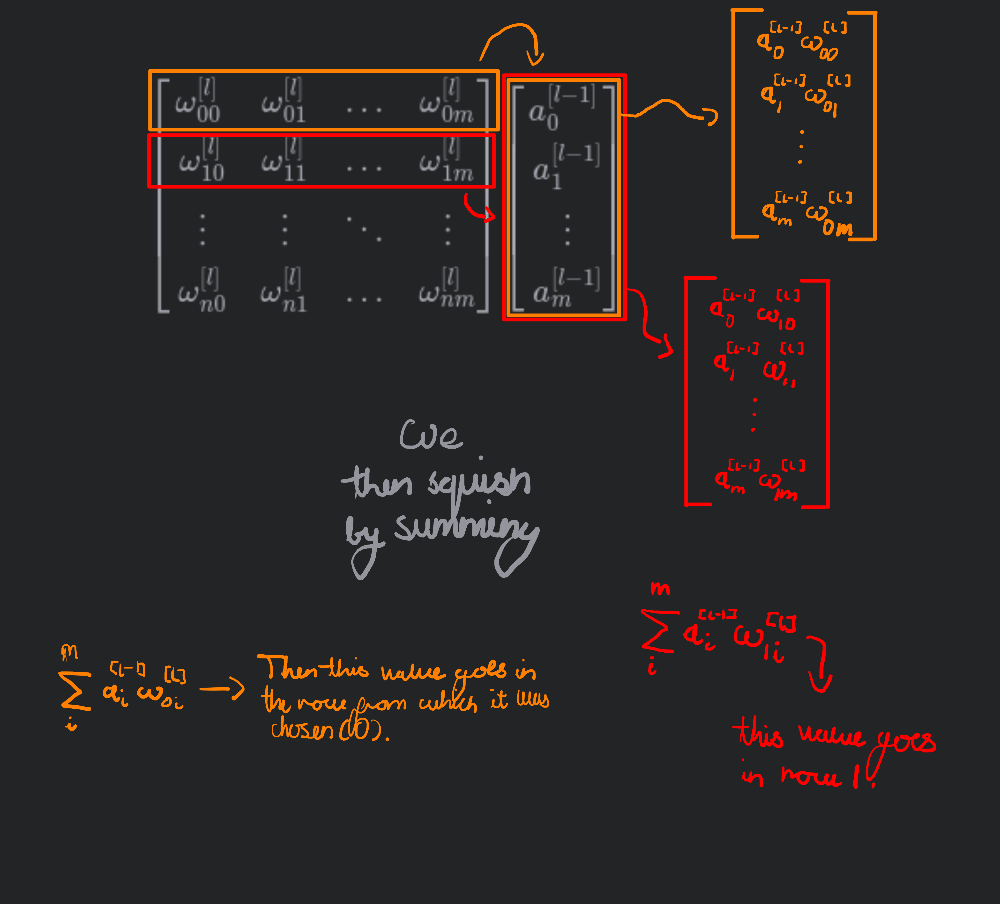
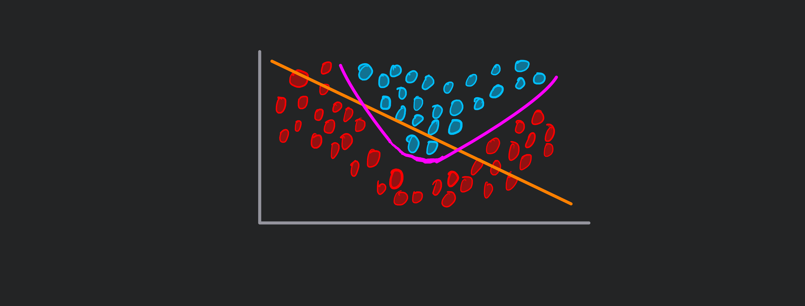
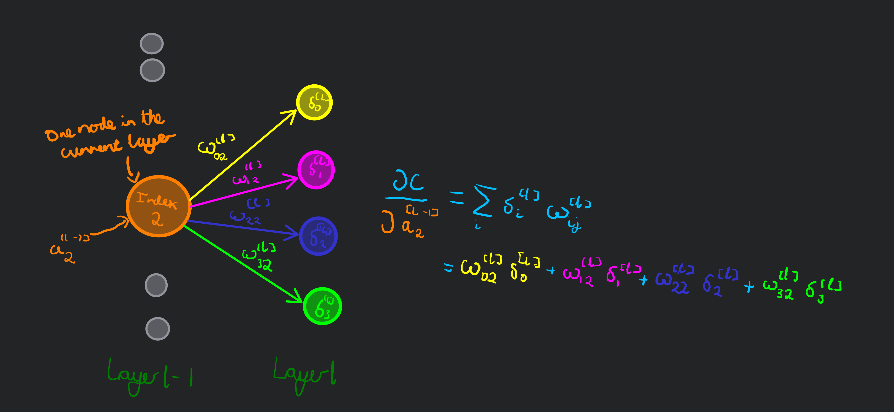

+++
title = 'The maths behind the MLP'
series = ['Making a MLP in rust, from scratch, for MNIST']
date = '2025-08-11T10:45:32+01:00'
draft = true
+++


This blog(/tutorial maybe?) is the first part in a walk-through of the process I followed to build a multi-layer-perceptron (MLP) from scratch in rust. Followed by using it to classify the [MNIST dataset](https://en.wikipedia.org/wiki/MNIST_database). The source code for the MLP can be found [here](https://github.com/max-amb/number_recognition).
This means no [pytorch](https://github.com/LaurentMazare/tch-rs) or [tensorflow](https://github.com/tensorflow/rust), both of which have rust bindings, just the rust standard library and the beautiful linear algebra crate, [nalgebra](https://nalgebra.rs/).

## Why from scratch
I am not entirely sure. Initially, I watched the first four episodes in the excellent [3blue1brown series on neural networks](https://youtube.com/playlist?list=PLZHQObOWTQDNU6R1_67000Dx_ZCJB-3pi&si=VXW032Kq09cHEgpa).
This piqued my interest and as I had an abundance of free time (having just finished my leaving school exams) I decided to implement a MLP for MNIST like the videos prescribed.
I considered using the previously discussed machine learning libraries, but they felt a bit like cheating and there was something (perhaps deceivingly) alluring about implementing the maths behind machine learning.
So, I went onwards.

## Intuition? 
This post is really focused on the algorithmic mathematics, and will not go into much - if any - intuition about it.
If you are interested in the intuition behind the mathematics I highly recommend the [3blue1brown series on neural networks](https://youtube.com/playlist?list=PLZHQObOWTQDNU6R1_67000Dx_ZCJB-3pi&si=VXW032Kq09cHEgpa) or this [open source textbook on machine learning](https://eng.libretexts.org/Bookshelves/Computer_Science/Applied_Programming/Neural_Networks_and_Deep_Learning_(Nielsen)).
I recommend you follow along with a **PEN AND PAPER** like all maths.

## Notation

We define the j'th node in the $l$'th layer to have a value of $a_j^{[l]}$. Layer $L$ is the output layer, layer $L-1$ is the layer that feeds into layer $L$ and so on. $a_j^{[l]}$ is calculated by summing the input nodes multiplied by their weights followed by the bias being added to that sum, then applying an activation function to that sum. So, if we denote our activation function as $f$. We have:

$$
a_j^{[l]} = f((\sum_i a_i^{[l-1]}\ \omega_{ji}^{[l]}) + b_j^{[l]})
$$

Here you can see how we denote weights: $\omega_{ji}^{[l]}$ represents the weight connecting node $a_i^{[l-1]}$ to node $a_j^{[l]}$.
You can think of it as the weights and biases of layer $l$ are used to calculate the value of the node in layer $l$.

The seemingly flipped notation for the subscript of the weights is because when we are using matrix multiplication this is how the matrix must be layed out.
The columns of the matrix must line up with the input neurons and the rows the output neurons for the multiplication to be valid.
Otherwise, the dimensions would be wrong.

To simplify this, we define $z_j^{[l]}$ to be the z value of the $j$'th node in layer $l$. The z value of a node is the value of a node __before__ the activation function is applied to the node.
So 
$$
z_j^{[l]} = (\sum_i a_i^{[l-1]}\ \omega_{ji}^{[l]}) + b_j^{[l]}
$$

This simplifies our previous expression of $a_j^{[l]}$ to:
$$
a_j^{[l]} = f(z_j^{[l]})
$$

Also, we must specify that we are using quadratic loss/cost (I will use the word loss for this blog) for this example, and loss will be denoted $C$, i.e:
$$
C = \sum_i (a_i - \hat{a_i})^2
$$
We use $\hat{a_i}$ to denote the expected value of node $a_i$ and $a_i$ to denote the observed value.
For example, we may have an observed output of:
$$
\begin{bmatrix} 0.858 \\ 0.450 \\ 0.646 \end{bmatrix}
$$
but an expected/label output of:
$$
\begin{bmatrix} 0 \\ 1 \\ 0\end{bmatrix}
$$
This means that $a_0 = 0.858$ and $\hat{a_0} ( = \hat{a_2} ) = 0$.

If you are skim reading this, please also check [some added notation](#added-notation).

Also, some (bad?) notation I use is instead of writing the full $i=0$ in the sum subscript, I only write $i$ as it looks cleaner. It is assumed that $i$ iterates over all of the elements possible in the vector or matrix.

## Forward pass
The forward pass takes the input to the neural network (some vector) and effectively *applies* the neural network to the input, transforming it to an output vector.
We do this by using the input to work out the values of the nodes in the second layer (or the first hidden layer), followed by the next hidden layer and so on until we we get to the output layer.

### Matrix notation
This process can be concisely represented with matrices and vectors.

#### Vector of z values
$$
z^{[l]} = \omega^{[l]} a^{[l-1]} + b^{[l]}
$$
where $a^{[l-1]}$ is the vector of layer $l-1$ of the MLP, and $z^{[l]}$ is the vector of z values for layer $l$ ($l$ is arbitrary).

To provide some intuition for this we can consider the $z^{[l]}$ vector:

Given $m+1$ nodes in the layer $[l-1]$ (input) and $n+1$ nodes in layer $[l]$ (output), we have a weights matrix:
$$
\omega^{[l]} = \begin{bmatrix} \omega_{00}^{[l]} & \omega_{01}^{[l]} & ... & \omega_{0m}^{[l]} \\\ \omega_{10}^{[l]} & \omega_{11}^{[l]} & ... & \omega_{1m}^{[l]} \\\ \vdots & \vdots & \ddots & \vdots \\\ \omega_{n0}^{[l]} & \omega_{n1}^{[l]} & ... & \omega_{nm}^{[l]} \end{bmatrix}
$$
a biases vector:
$$
b^{[l]} = \begin{bmatrix} b_0^{[l]} \\\ b_1^{[l]} \\\ \vdots \\\ b_n^{[l]} \end{bmatrix}
$$
and a vector of the nodes in layer $l-1$:
$$
a^{[l-1]} = \begin{bmatrix} a_0^{[l-1]} \\\ a_1^{[l-1]} \\\ \vdots \\\ a_m^{[l-1]} \end{bmatrix}
$$
And we want a vector, $z^{[l]}$, as follows:
$$
z^{[l]} = \begin{bmatrix} (\sum_i^m a_i^{[l-1]}\ \omega_{0i}^{[l]}) + b_0^{[l]} \\\ (\sum_i^m a_i^{[l-1]}\ \omega_{1i}^{[l]}) + b_1^{[l]} \\\ \vdots \\\ (\sum_i^m a_i^{[l-1]}\ \omega_{ni}^{[l]}) + b_n^{[l]} \end{bmatrix}
$$
Intuitively, matrix multiplication can be visualised as rotating a row from the matrix on the left, and superimposing that row on top of a column from the matrix on the right, and summing the values produced by multiplying the superimposed values and the values in the column.

Once we have this vector:
$$
\begin{bmatrix} \sum_{i}^{m}a_i^{[l-1]}\omega_{0i}^{[l]} \\\ \sum_{i}^{m}a_i^{[l-1]}\omega_{1i}^{[l]} \\\ \vdots \\\ \sum_{i}^{m}a_i^{[l-1]}\omega_{ni}^{[l]} \end{bmatrix}
$$
we simply need to add the biases vector to get $z^{[l]}$, i.e.:
$$
z^{[l]} = \begin{bmatrix} \sum_{i}^{m}a_i^{[l-1]}\omega_{0i}^{[l]} \\\ \sum_{i}^{m}a_i^{[l-1]}\omega_{1i}^{[l]} \\\ \vdots \\\ \sum_{i}^{m}a_i^{[l-1]}\omega_{ni}^{[l]} \end{bmatrix} +\begin{bmatrix} b_0^{[l]} \\\ b_1^{[l]} \\\ \vdots \\\ b_n^{[l]} \end{bmatrix} = \omega^{[l]}a^{[l-1]} + b^{[l]} 
$$

#### Vector of neuron values 
Now we have our vector of z values we need to go to a vector of neuron values.
This is simply done by applying an activation function, $f$, to each element in the vector and this is denoted as follows:
$$
a^{[l]} = f(z^{[l]})
$$
The activation function will typically differ depending on if we are travelling into a hidden layer or the final output layer.
For example, you may use sigmoid for the output layer and Relu for the other layers.

##### Non-linearity
We need an activation function to introduce non-linearity to the network to allow the network to learn non-linear relationships between the input and the output.
Otherwise the network could only fit a straight line.
Imagine the following scenario: we are trying to fit a line that seperates two clusters:

If we were restricted to linearity we would only be able to use the orange line. But, with non-linearity, we can use the pink line, which is obviously better.

#### Conclusion
That is all the forward pass is! Matrix operation, followed by activation function, followed by matrix operation, followed by activation function, and so on, until the end of time.

## Backpropagation
### Output layer derivatives
In order to begin backpropagation, we need to determine how much we need to change the output nodes values by.
This can be done with partial derivatives, i.e. calculating: $\frac{\partial C}{\partial a_j^{[L]}}$. This will tell us how much the $a_j^{[L]}$'s  observed value needs to change by.
Here we use $a_j^{[L]}$ to denote the node we are calculating with respect to (wrt.) and we use $i$ as the *iterator* as such.

$$
\begin{aligned}
\frac{\partial C}{\partial a_j^{[L]}} & = \frac{\partial \sum_i (a_i^{[L]} - \hat{a_i^{[L]}})^2}{\partial a_j^{[L]}} \\
& = \frac{\partial}{\partial a_j^{[L]}} (a_0^{[L]} - \hat{a_0^{[L]}})^2 + (a_1^{[L]} - \hat{a_1^{[L]}})^2 + ...\ +(a_i^{[L]} - \hat{a_i^{[L]}})^2 \\
& = \frac{\partial}{\partial a_j^{[L]}} (a_j^{[L]} - \hat{a_j^{[L]}})^2 \\
& = 2 \ (a_j^{[L]} - \hat{a_j^{[L]}})
\end{aligned}
$$

This is all well and good finding the amount $a_j^{[L]}$ needs to change by, but we (obviously) cannot directly change the value of $a_j^{[L]}$, we can only influence it via changing it's weights and biases.

#### Bias derivative
So we need to find $\frac{\partial C}{\partial b_j^{[L]}}$. We can do it with some *__chain rule!!__*.
$$
\frac{\partial C}{\partial b_j^{[L]}} = \frac{\partial C}{\partial a_j^{[L]}} \frac{\partial a_j^{[L]}}{\partial z_j^{[L]}} \frac{\partial z_j^{[L]}}{\partial b_j^{[L]}}
$$

We already know:

$$
\frac{\partial C}{\partial a_j^{[L]}} = 2 \ (a_j^{[L]} - \hat{a_j^{[L]}})
$$

To determine $\frac{\partial a_j^{[L]}}{\partial z_j^{[L]}}$ we use our previous definition of $a_j^{[L]} = f(z_j^{[L]})$:

$$
\begin{aligned}
\frac{\partial a_j^{[L]}}{\partial z_j^{[L]}} & = \frac{\partial}{\partial z_j^{[L]}} f(z_j^{[L]}) \\
& = f'(z_j^{[L]}) \ 1 = f'(z_j^{[L]})
\end{aligned}
$$
$\frac{\partial f}{\partial {z_j^{[L]}}}$ obviously depends on the activation function.

Finally, to determine $\frac{\partial z_j^{[L]}}{\partial b_j^{[L]}}$ is trivial as $z_j^{[L]} = (\sum_i a_i^{[L-1]}\ \omega_{ji}^{[L]}) + b_j^{[L]}$.
So:
$$
\frac{\partial z_j^{[L]}}{\partial b_j^{[L]}} = \frac{\partial}{\partial b_j^{[L]}} b_j^{[L]} = 1
$$
This falls out because when doing a partial derivative we discard all terms that do not contain the variable we are deriving with respect to, so in this case, we are left with just the $b_j^{[L]}$ term.

$$
\therefore \frac{\partial C}{\partial b_j^{[L]}} = \frac{\partial C}{\partial a_j^{[L]}} \frac{\partial a_j^{[L]}}{\partial z_j^{[L]}} \frac{\partial z_j^{[L]}}{\partial b_j^{[L]}} = 2 \ (a_j^{[L]} - \hat{a_j^{[L]}})\ f'(z_j^{[L]})
$$

#### Weight derivative
To find $\frac{\partial C}{\partial \omega_{ji}^{[L]}}$ we can use our work in [finding the bias derivative](#bias-derivative).
> If you are confused about this notation please look back to [the notation section](#notation).
Remember here we are travelling from node $a_i^{[L-1]}$ to node $a_j^{[L]}$ via $\omega_{ji}^{[L]}$.

We need to find $\frac{\partial C}{\partial \omega_{ji}^{[L]}}$ which similarly to before, via the chain rule, we can determine to be:
$$
\frac{\partial C}{\partial \omega_{ji}^{[L]}} = \frac{\partial C}{\partial a_j^{[L]}} \frac{\partial a_j^{[L]}}{\partial z_j^{[L]}} \frac{\partial z_j^{[L]}}{\partial \omega_{ji}^{[L]}}
$$

We have already worked out $\frac{\partial C}{\partial z_j^{[L]}}$:
$$
\frac{\partial C}{\partial z_j^{[L]}} = \frac{\partial C}{\partial a_j^{[L]}} \frac{\partial a_j^{[L]}}{\partial z_j^{[L]}} = 2 \ (a_j^{[L]} - \hat{a_j^{[L]}})\ f'(z_j^{[L]})
$$
So we just need to find $\frac{\partial z_j^{[L]}}{\partial \omega_{ji}^{[L]}}$:
$$
\begin{aligned}
\frac{\partial z_j^{[L]}}{\partial \omega_{ji}^{[L]}} & = \frac{\partial}{\partial \omega_{ji}^{[L]}} z_j^{[L]} \\
& = \frac{\partial}{\partial \omega_{ji}^{[L]}} a_i^{[L-1]} \omega_{ji}^{[L]} \\
& = a_i^{[L-1]} 
\end{aligned}
$$

$$
\therefore \frac{\partial C}{\partial \omega_{ji}^{[L]}} = 2 \ (a_j^{[L]} - \hat{a_j^{[L]}})\ f'(z_j^{[L]}) \ a_i^{[L-1]}
$$

#### Delta
If you read the previous two sections carefully enough, you may notice a consistency.
We used $\frac{\partial C}{\partial a_j^{[L]}} \frac{\partial a_j^{[L]}}{\partial z_j^{[L]}}$ in both of these calculations.
Mathematicians, in their constant search for more compact notation, have decided to denote this as $\delta_j^{[L]}$, i.e.

$$
\frac{\partial C}{\partial a_j^{[L]}} \frac{\partial a_j^{[L]}}{\partial z_j^{[L]}} = \delta_j^{[L]} = 2 \ (a_j^{[L]} - \hat{a_j^{[L]}})\ f'(z_j^{[L]})
$$

This means we can represent the [bias derivative](#bias-derivative) as simply:
$$
\frac{\partial C}{\partial b_j^{[L]}} = \delta_j^{[L]}
$$
and the [weight derivative](#weight-derivative) as:
$$
\frac{\partial C}{\partial \omega_{ji}^{[L]}} = \delta_j^{[L]} a_i^{[L-1]}
$$

#### Representation of output layer backpropagation as a matrix operation
We can represent backpropagation as a series of matrix operations which allows for more concise notation.
To find the delta values we use the [hadarmard product](https://en.wikipedia.org/wiki/Hadamard_product_(matrices)) denoted $\odot$.

To do this section succinctly we must further define some more *__notation__* woop woop!

##### Added notation
We define a new vector $\nabla_{a^{[L]}}C$, to be the derivative of the loss function wrt. each element in the output layer ($a^{[L]}$).
Note you may see this written as just $\nabla_{a}C$ to be more concise.
Therefore:
$$
\nabla_{a}C = \begin{bmatrix} 2 \ (a_0^{[L]} - \hat{a_0^{[L]}}) \\\ 2 \ (a_1^{[L]} - \hat{a_1^{[L]}}) \\\ \vdots \\\ 2 \ (a_n^{[L]} - \hat{a_n^{[L]}}) \end{bmatrix}
$$
for $n+1$ nodes in the output layer.

This allows us to write $\delta^{[L]}$ (the vector of the delta values):
$$
\delta^{[L]} = \nabla_a C \ \odot\  f'(z^{[L]})
$$
Where $z^{[L]}$ is the vector of the z values and we apply $f'$ to every value in that vector.

> If this isn't immediately obvious to you, remember that $\delta_j^{[L]} = 2 \ (a_j^{[L]} - \hat{a_j^{[L]}})\ f'(z_j^{[L]})$.
> So you can think of $\delta^{[L]}$ being composed by just iterating $j$ over all of the output nodes.

So now we have a vector of delta values: 
$$
\delta^{[L]} = \begin{bmatrix} \delta_0^{[L]} \\\ \delta_1^{[L]} \\\ \vdots \\\ \delta_n^{[L]} \end{bmatrix}
$$
for $n+1$ nodes in the output layer.

This gives us the vector of the derivatives of the loss wrt. the biases, as:
$$
\frac{\partial C}{\partial b_j^{[L]}} = \delta_j^{[L]} \implies \frac{\partial C}{\partial b^{[L]}} = \delta^{[L]}
$$

Now, to find the matrix of the derivative of the loss wrt. the weights it is useful to look again at the structure of the weights matrix: 
$$
\omega^{[L]} = \begin{bmatrix} \omega_{00}^{[L]} & \omega_{01}^{[L]} & \omega_{02}^{[L]} & ... & \omega_{0m}^{[L]} \\\ \omega_{10}^{[L]} & \omega_{11}^{[L]} & \omega_{12}^{[L]} & ... & \omega_{1m}^{[L]} \\\ \vdots & \vdots & \vdots & \ddots & \vdots \\\ \omega_{n0}^{[L]} & \omega_{n1}^{[L]} & \omega_{n2}^{[L]} & ... & \omega_{nm}^{[L]} \end{bmatrix}
$$
for $m+1$ nodes in the input layer and $n+1$ nodes in the output layer.

We now begin to construct the matrix of derivatives by looking at an example.
For example, $\omega_{01}^{[L]}$ connects node $a_1^{[L-1]}$ to node $a_0^{[L]}$, and has derivative:

$$
\frac{\partial C}{\partial \omega_{01}^{[L]}} = \delta_0^{[L]} a_1^{[L-1]}
$$

Therefore, at $\omega_{01}^{[L]}$'s position in the weight matrix, the value in the corresponding position in the matrix of derivatives should be $\delta_0^{[L]} a_1^{[L-1]}$.

Leaning on intuition, we can construct the desired form of our matrix of derivatives of the loss wrt. the weights:
$$
\frac{\partial C}{\partial \omega^{[L]}} = \begin{bmatrix} \delta_{0}^{[L]} a_{0}^{[L-1]} & \delta_{0}^{[L]} a_{1}^{[L-1]} & \delta_{0}^{[L]} a_{2}^{[L-1]} & ... & \delta_{0}^{[L]} a_{m}^{[L-1]} \\\ \delta_{1}^{[L]} a_{0}^{[L-1]} & \delta_{1}^{[L]} a_{1}^{[L-1]} & \delta_{1}^{[L]} a_{2}^{[L]} & ... & \delta_{1}^{[L]} a_{m}^{[L]} \\\ \vdots & \vdots & \vdots & \ddots & \vdots \\\ \delta_{n}^{[L]} a_{0}^{[L-1]} & \delta_{n}^{[L]} a_{1}^{[L-1]} & \delta_{n}^{[L]} a_{2}^{[L-1]} & ... & \delta_{n}^{[L]} a_{m}^{[L-1]} \end{bmatrix}
$$
All nodes in the first row of the matrix effect the same output node, so they must be multiplied by the same delta value (that output node in this case has index zero).

We can see this is an operation between the delta vector $\delta^{[L]}$ and the layer vector $a^{[L-1]}$ (the layer vector is just the vector of the values in the layer).
This operation, of merging the delta vector and the layer vector like so, is a common enough operation in linear algebra that it has it's own notation and name: it is the outer product, denoted $\otimes$. So:
$$
\frac{\partial C}{\partial \omega^{[L]}} = \delta^{[L]} \otimes a^{[L-1]}
$$

The outer product is equivalent to multiplying by the transpose matrix, i.e.:
$$
\frac{\partial C}{\partial \omega^{[L]}} = \delta^{[L]} a^{{[L-1]}^{T}}
$$

#### Conclusion of the output layer derivatives
To conclude, we have worked out how to get a vector of the derivatives of the loss wrt. the biases, and how to get a matrix of the derivatives of the loss wrt. the weights for the output layer:
$$
\frac{\partial C}{\partial b^{[L]}} = \delta^{[L]}, 
\frac{\partial C}{\partial \omega^{[L]}} = \delta^{[L]} a^{{[L-1]}^{T}}
$$
where $\delta^{[L]} = \nabla_a L \ \odot\  f'(z^{[L]})$

### Hidden layer derivatives
We begin this section similarly to how we began [for the output layer](#output-layer-derivatives). We need the derivative of the loss wrt. to a node.
However, now we need the derivative of the cost wrt. an arbitrary node in the layer $[l-1]$. Lets call it $a_j^{[l-1]}$:
$$
\frac{\partial C}{\partial a_j^{[l-1]}} = \sum_i \frac{\partial C}{\partial a_i^{[l]}} \frac{\partial a_i^{[l]}}{\partial z_i^{[l]}} \frac{\partial z_i^{[l]}}{\partial a_j^{[l-1]}}
$$
What? Why is there a sum? There is a rigorous way to argue this which I do not understand yet (though I might in a future post?), but conceptually/intuitively it seems quite obvious.

#### Intuition behind the derivative sum
Consider the node $a_j^{[l-1]}$, in our fully connected MLP, the value of the node effects the values of __ALL__ of the nodes in the following layer.
I.e. changing the value of $a_j^{[l-1]}$ effects every value in $a^{[l]}$.
This consequence is easier to think of if we imagine we are in the layer directly preceding the layer before the output layer (whose derivatives we have already worked out).

This means that the total amount $a_j^{[l-1]}$ effects the loss function (the derivative of the loss function wrt. $a_j^{[l-1]}$) depends on all of the nodes in the following layer.
So, to find the total impact of $a_j^{[l-1]}$  on the loss function, we need to sum its individual impacts on the individual nodes in the following layer.

If this call to your intuition hasn't landed I thoroughly recommend you research this further, it's a subtopic in [automatic differentiation](https://en.wikipedia.org/wiki/Automatic_differentiation) and there are many good videos like [this one](https://www.youtube.com/watch?v=FtnkqIsfNQc) that explore it further.

Now, taking our sum derivative to be true, we can proceed by subsituting in delta which we have already worked out:
$$
\begin{aligned}
\frac{\partial C}{\partial a_j^{[l-1]}} & = \sum_i \frac{\partial C}{\partial a_i^{[l]}} \frac{\partial a_i^{[l]}}{\partial z_i^{[l]}} \frac{\partial z_i^{[l]}}{\partial a_j^{[l-1]}} \\
& = \sum_i \delta_i^{[l]} \frac{\partial z_i^{[l]}}{\partial a_j^{[l-1]}}
\end{aligned}
$$

We need to determine $\frac{\partial z_i^{[l]}}{\partial a_j^{[l-1]}}$:
$$
\begin{aligned}
\frac{\partial z_i^{[l]}}{\partial a_j^{[l-1]}} = \frac{\partial}{\partial a_j^{[l-1]}} (\sum_k a_k^{[l-1]}\ \omega_{ik}^{[l]}) + b_i^{[l]}
\end{aligned}
$$
There will be one case in the sum where $j=k$ (in the rest of the cases $j!=k$ so the terms will disappear):
$$
\begin{aligned}
\frac{\partial}{\partial a_j^{[l-1]}} (\sum_k a_k^{[l-1]}\ \omega_{ik}^{[l]}) + b_i^{[l]} & = \frac{\partial}{\partial a_j^{[l-1]}} a_k^{[l-1]}\ \omega_{ik}^{[l]} \\
& = \omega_{ik}^{[l]}
= \omega_{ij}^{[l]} \\
\implies \frac{\partial z_i^{[l]}}{\partial a_j^{[l-1]}} = \omega_{ij}^{[l]}
\end{aligned}
$$

So, substituting back in:
$$
\begin{aligned}
\frac{\partial C}{\partial a_j^{[l-1]}} & = \sum_i \delta_i^{[l]} \frac{\partial z_i^{[l]}}{\partial a_j^{[l-1]}} \\
& = \sum_i \delta_i^{[l]} \omega_{ij}^{[l]}
\end{aligned}
$$

This sum may look a bit mysterious at first but it is simply iterating over all of the nodes that are in the following layer, and multiplying the weight of the connection against the delta value of the node in the following layer.

#### Derivative of the bias
Now we have $\frac{\partial C}{\partial a_j^{[l-1]}}$ we can work out $\frac{\partial C}{\partial b_j^{[l-1]}}$ pretty easily and similarly to before.
The chain rule tells us:
$$
\frac{\partial C}{\partial b_j^{[l-1]}} = \frac{\partial C}{\partial a_j^{[l-1]}} \frac{\partial a_j^{[l-1]}}{\partial z_j^{[l-1]}} \frac{\partial z_j^{[l-1]}}{\partial b_j^{[l-1]}}
$$
This may (hopefully) look familiar... it is almost exactly the same as what we had before! The one difference is the layer, instead of layer $L-1$, we are now working with the arbitrary layer $l-1$.
It makes sense that they look similar as we are of course working out similar quantities.
This means we can look back at our previous work and say that:
$$
\frac{\partial a_j^{[l-1]}}{\partial z_j^{[l-1]}} = f'(z_j^{[l-1]})
$$
The only change being $z_j^{[l]} \to z_j^{[l-1]}$.

Then, working out the $\frac{\partial z_j^{[l-1]}}{\partial b_j^{[l-1]}}$ is as trivial as before and again, it is $1$.

So:
$$
\begin{aligned}
\frac{\partial C}{\partial b_j^{[l-1]}} & = \frac{\partial C}{\partial a_j^{[l-1]}} \frac{\partial a_j^{[l-1]}}{\partial z_j^{[l-1]}} \frac{\partial z_j^{[l-1]}}{\partial b_j^{[l-1]}} \\
& = (\sum_i \delta_i^{[l]} \omega_{ij}^{[l]}) \ f'(z_j^{[l-1]})
\end{aligned}
$$

#### Derivative of the weight
Similarly to in working out the new [derivative of the bias](#derivative-of-the-bias), we can lean on previous work here.
Via the chain rule, we need:
$$
\frac{\partial C}{\partial \omega_{ji}^{[l-1]}} = \frac{\partial C}{\partial a_j^{[l-1]}} \frac{\partial a_j^{[l-1]}}{\partial z_j^{[l-1]}} \frac{\partial z_j^{[l-1]}}{\partial \omega_{ji}^{[l-1]}}
$$

Looking back at our previous work ([here](#derivative-of-the-bias)), we can see that:
$$
\frac{\partial a_j^{[l-1]}}{\partial z_j^{[l-1]}} \frac{\partial z_j^{[l-1]}}{\partial \omega_{ji}^{[l-1]}} = \ f'(z_j^{[l-1]}) \frac{\partial z_j^{[l-1]}}{\partial \omega_{ji}^{[l-1]}}
$$
Then, looking back at [finding the derivative of the weights on the output layer](#weight-derivative), we can see:
$$
\frac{\partial z_j^{[l-1]}}{\partial \omega_{ji}^{[l-1]}} = a_i^{[l-2]}
$$
The only change being $a_i^{[l-1]} \to a_i^{[l-2]}$.

So:
$$
\begin{aligned}
\frac{\partial C}{\partial \omega_{ji}^{[l-1]}} & = \frac{\partial C}{\partial a_j^{[l-1]}} \frac{\partial a_j^{[l-1]}}{\partial z_j^{[l-1]}} \frac{\partial z_j^{[l-1]}}{\partial \omega_{ji}^{[l-1]}} \\
& = (\sum_i \delta_i^{[l]} \omega_{ij}^{[l]}) \ f'(z_j^{[l-1]}) \ a_i^{[l-2]}
\end{aligned}
$$

#### Delta's again
We (similarly to [before](#delta)), spot a similarity in our derivatives for the weights and biases.
Both contain a $(\sum_i \delta_i^{[l]} \omega_{ij}^{[l]}) \ f'(z_j^{[l-1]})$ term.
And, like before, this term is equal to the derivative of the loss function wrt. the bias (due to the expressions being extremely similar), and multiplying it by the value of the neuron in the preceding layer gives the derivative of the loss function wrt. the weight.
So, we write:
$$
\delta_j^{[l-1]} = \frac{\partial C}{\partial a_j^{[l-1]}} \frac{\partial a_j^{[l-1]}}{\partial z_j^{[l-1]}} = (\sum_i \delta_i^{[l]} \omega_{ij}^{[l]}) \ f'(z_j^{[l-1]})
$$
Giving:
$$
\frac{\partial C}{\partial b_j^{[l-1]}} = \delta_j^{[l-1]}
$$
and
$$
\frac{\partial C}{\partial \omega_{ji}^{[l-1]}} = \delta_j^{[l-1]} a_i^{[l-2]}
$$

#### Representation of hidden layer backpropagation as a matrix operation
As we did for the [output layer](#representation-of-output-layer-backpropagation-as-a-matrix-operation), we can represent hidden layer backpropagation using linear algebra.

First, we need a way to obtain a vector of delta values for the layer.
The $f'(z_j^{[l-1]})$ term is trivial: as before, we just apply $f'$ to every element in the $z^{[l-1]}$ vector:
$$
f'(z^{[l-1]})
$$

Now we need to find a way to get $\sum_i \delta_i^{[l]} \omega_{ij}^{[l]}$ for each neuron in the layer.
It is obviously going to be formed by some combination of the weights matrix ($\omega^{[l]}$) and the delta vector ($\delta^{[l]}$) as these are the only two terms in the sum.
If we consider the weights matrix:
$$
\omega^{[l]} = \begin{bmatrix} \omega_{00}^{[l]} & \omega_{01}^{[l]} & ... & \omega_{0m}^{[l]} \\\ \omega_{10}^{[l]} & \omega_{11}^{[l]} & ... & \omega_{1m}^{[l]} \\\ \vdots & \vdots & \ddots & \vdots \\\ \omega_{n0}^{[l]} & \omega_{n1}^{[l]} & ... & \omega_{nm}^{[l]} \end{bmatrix}
$$
for $m+1$ nodes in the input layer and $n+1$ in the following layer.
And the delta matrix:
$$
\delta^{[l]} = \begin{bmatrix} \delta_0^{[l]} \\ \delta_1^{[l]} \\ \vdots \\ \delta_n^{[l]} \end{bmatrix}
$$
with, as expected, $n+1$ entries.

We can see that the dimensions do not match up if we just wanted to multiply them, as $m$ does not necessarily equal $n$.
However, if we transpose the weights matrix, giving us:
$$
{\omega^{[l]}}^T = \begin{bmatrix} \omega_{00}^{[l]} & \omega_{10}^{[l]} & ... & \omega_{n0}^{[l]} \\ \omega_{01}^{[l]} & \omega_{11}^{[l]} & ... & \omega_{n1}^{[l]} \\ \vdots & \vdots & \ddots & \vdots \\ \omega_{0m}^{[l]} & \omega_{1m}^{[l]} & ... & \omega_{nm}^{[l]} \end{bmatrix}
$$
we can multiply this by the delta vector and the dimensions will be correct.

${\omega^{[l]}}^T \delta^{[l]}$ not only has the correct dimensions, it also gives us a vector the results we would like:

$$
{\omega^{[l]}}^T \delta^{[l]} = \begin{bmatrix} \sum_i \delta_i^{[l]} \omega_{i0}^{[l]} \\ \sum_i \delta_i^{[l]} \omega_{i1}^{[l]} \\ \vdots \\ \sum_i \delta_i^{[l]} \omega_{im}^{[l]} \end{bmatrix}
$$

> If this isn't obvious to you, see [earlier](#vector-of-z-values) which is similar and/or try it in a calculator to verify to yourself that this is in fact the case

Putting it all together, we now have $\delta^{[l-1]}$ for any arbitrary layer!

$$
\delta^{[l-1]} = ({\omega^{[l]}}^T \delta^{[l]}) \ f'(z^{[l-1]})
$$

This instantly gives us $b^{[l-1]}$ as:
$$
b^{[l-1]} = \delta^{[l-1]}
$$

We can quickly obtain $\omega^{[l-1]}$ with the same method as before [when we did this for the output layer](#representation-of-output-layer-backpropagation-as-a-matrix-operation).
$$
\omega^{[l-1]} = \delta^{[l-1]} {a^{[l-2]}}^T
$$

#### Conclusion of the hidden layer derivatives
We conclude very similarly to how we did in the [conclusion of the output layer derivatives](#conclusion-of-the-output-layer-derivatives).
However, this time we have done it for any arbitrary layer (but the layer preceding the output layer) which we have denoted layer $l-1$.
It only depends on the delta values of the layer ($l$) above it:
$$
\frac{\partial C}{\partial b^{[l-1]}} = \delta^{[l-1]},
\frac{\partial C}{\partial \omega^{[l-1]}} = \delta^{[l-1]} a^{{[l-2]}^{T}}
$$
where $\delta^{[L]} = ({\omega^{[l]}}^T \delta^{[l]}) \ f'(z^{[l-1]})$

## Conclusion
This concludes the mathematics behind the MLP.

We began by working out how to transform an input into its output through the neural network.
Followed by determining the derivatives of the weights and biases wrt. the loss for the nodes connecting to the output layer.
And then we determined the derivatives of the weights and biases wrt. the loss for any arbitrary layer but the layer connecting to the output layer.
This, sort of similarly to weak induction, allows us to determine the derivatives of the weights and biases wrt. the loss for any layer in the network.

Repeating this cycle allows us to train an MLP to do a variety of tasks, including classification of numbers, what we will be doing next!

Thank you for reading my first blog! Any comments are welcome below :).
